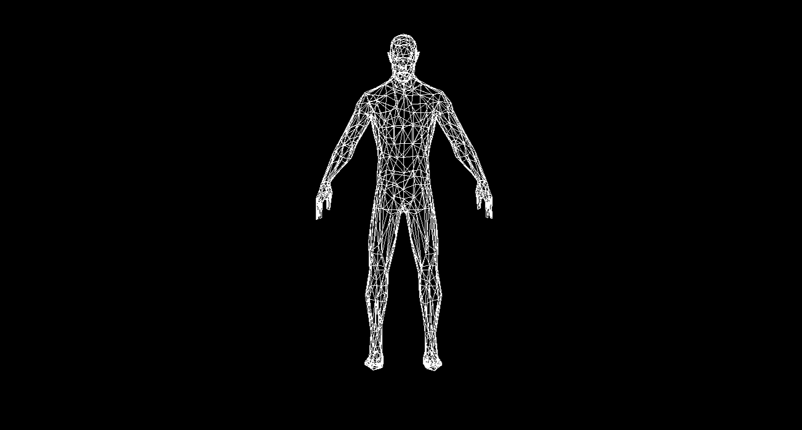

# 3D Software Engine in Python

This project is a 3D software engine written in Python using the Pygame library and the NumPy module. The engine allows you to create, load, and display real 3D models, providing the capability to move and rotate them in 3D space.



## Installation

To get started, install the required modules using the following command:

```bash
pip install pygame numpy numba
```

### Basic Structure

The project consists of several components:

1. **Main Application Class:**
   - The main application class includes a constructor defining standard Pygame objects such as window, resolution, and frames per second.
   - Two methods are implemented: one for rendering and another for the main program loop.

2. **Object Class:**
   - The object class represents 3D objects and includes methods for translating, rotating, and scaling.
   - Vertices of the object are defined in homogeneous coordinates, and faces are represented by vertex indices.

3. **Camera Class:**
   - The camera class is responsible for defining the camera's position, orientation, and field of view.
   - It provides functions for transforming the world coordinate system to the camera coordinate system.

4. **Projection Class:**
   - The projection class forms the projection matrix necessary for projecting 3D coordinates onto a 2D screen.

### How its Functions

3D Graphics Basics
The project includes detailed explanations of 3D graphics concepts, including the world coordinate system, object vertices, faces, local coordinate systems, and actions like moving, rotating, and scaling objects.

### File Structure

- **MatrixFunctions.py:**
  - Defines functions for creating matrices for translation, rotation, and scaling.

- **Object.py:**
  - Implements the object class with methods for transforming and drawing 3D objects.

- **Camera.py:**
  - Contains the camera class with functions for camera movement and rotation.

- **Projection.py:**
  - Implements the projection class for creating the projection matrix.

- **main.py:**
  - The main file where the application is initiated, and objects are created and displayed.

- **Parser.py:**
  - Parses a real 3D model in OBJ file format, creating an instance of the object class.

## Usage

1. Clone the repository.
2. Install the required modules using `pip install pygame numpy numba`.
3. Run the `main.py` file to see the 3D engine in action.

## Credit

Credits for the 3D model go to mruboy
https://sketchfab.com/3d-models/body-export001-6668602f820e422b95b780ab6fd41c38
